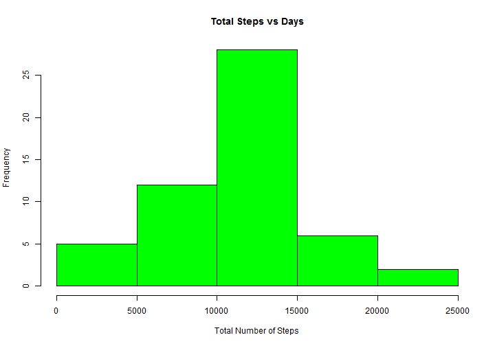
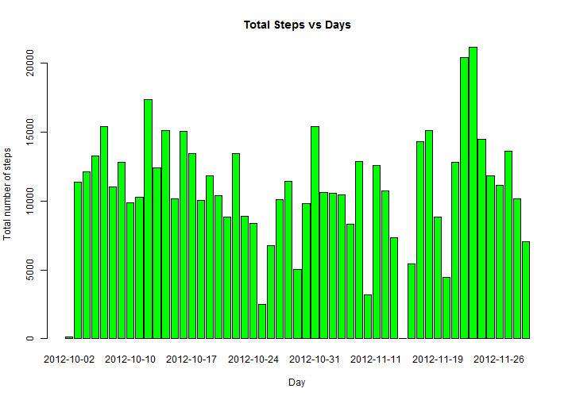
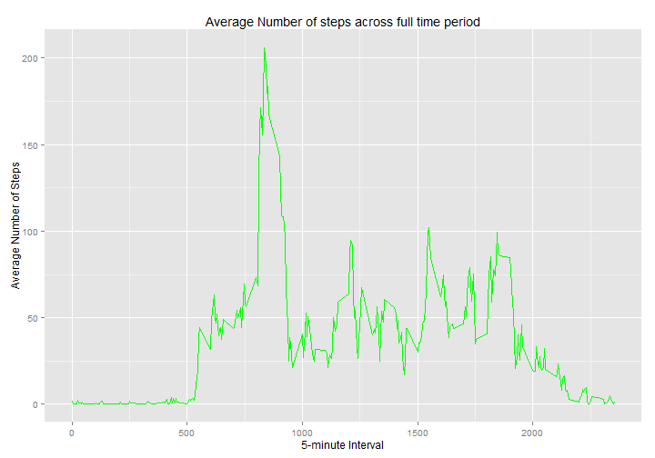
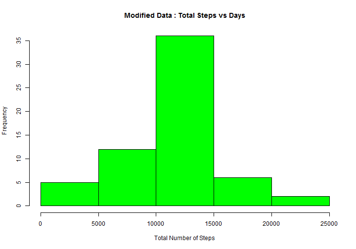
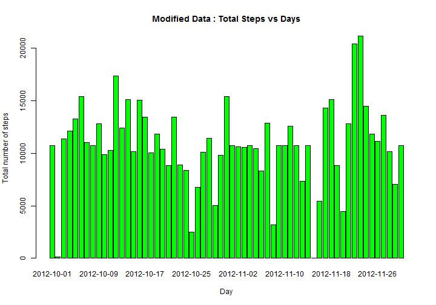
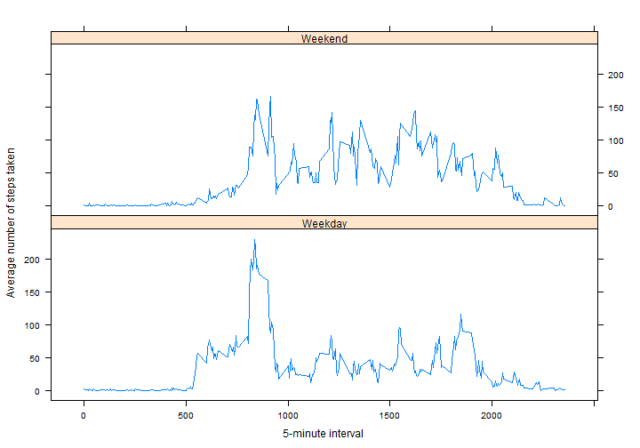

This assignment makes use of data from a personal activity monitoring device. This device collects data at 5 minute intervals through out the day. The data consists of two months of data from an anonymous individual collected during the months of October and November, 2012 and include the number of steps taken in 5 minute intervals each day.

The data for this assignment can be downloaded from <https://d396qusza40orc.cloudfront.net/repdata%2Fdata%2Factivity.zip>

##Prerequisite
###Loading libraries

```r
library(lattice)
library(ggplot2)
```
To make sure the code, messages and output are visible,

```r
echo = TRUE
```
##Loading and preprocessing the data

- Read the data in the CSV file into `completeData` by assigning data types to each columns present in it.

- List out the first couple of entries in the data to verify that the variables are loaded properly.

- Omit all `NA` values

Check the dimensions of data before and after omission.

```r
completeData <- read.csv("activity.csv", header=T, quote="\"", sep=",", colClasses = c("numeric", "Date", "factor"))
head(completeData)
```

```
##   steps       date interval
## 1    NA 2012-10-01        0
## 2    NA 2012-10-01        5
## 3    NA 2012-10-01       10
## 4    NA 2012-10-01       15
## 5    NA 2012-10-01       20
## 6    NA 2012-10-01       25
```

```r
dim(completeData)
```

```
## [1] 17568     3
```

```r
data <- na.omit(completeData)
dim(data)
```

```
## [1] 15264     3
```

##What is mean total number of steps taken per day?

### Make a histogram of the total number of steps taken each day
- For this let us sum up the number of steps taken each day and store the result in `stepsDay`

```r
stepsDay <- aggregate(steps ~ date, data, sum)
```
- To know the frequency of number of steps taken per day, we can plot a histogram of the number of steps taken each day.

```r
hist(stepsDay$steps, main = paste("Total Steps vs Days"),  col = "green", xlab="Total Number of Steps")
```

 
- We can also use the `barplot` function to create a barplot of the total number of steps taken each day.

```r
barplot(stepsDay$steps, col = "green", names.arg = stepsDay$date, main = "Total Steps vs Days", xlab = "Day", ylab = "Total number of steps")
```

 

### Calculate and report the *mean* and *median* total number of steps taken per day

- Calculate the mean of the steps of data in variable `stepsDay`

```r
mean <- round(mean(stepsDay$steps))
mean
```

```
## [1] 10766
```

- Calculate the median of the steps of data in variable `stepsDay`

```r
median <- round(median(stepsDay$steps))
median
```

```
## [1] 10765
```

## What is the average daily activity pattern?

### Make a time series plot of the 5-minute interval (x-axis) and the average number of steps taken, averaged across all days (y-axis)

- To achieve this, the variable `interval` should be of numeric type. Since it was declared of factor type, it needs to be coerced to numeric type.

- We use the `aggregate` function again to compute the mean values of steps and store the result in `stepsMean`.

- Plot the 5-minute interval versus the average number of steps taken averaged across all days using `ggplot`.


```r
tempInt <- list(interval = as.numeric(as.character(data$interval)))
stepsMean <- aggregate(data$steps, tempInt, FUN = "mean")
ggplot(stepsMean, aes(interval, x)) + geom_line(colour = 'green') + labs(title = "Average Number of steps across full time period", x = "5-minute Interval", y = "Average Number of Steps")
```

 

###Which 5-minute interval, on average across all the days in the dataset, contains the maximum number of steps?

- Here we fetch the data in the row corresponding to the largest mean in `stepsMean`


```r
stepsMean[which.max(stepsMean$x), ]
```

```
##     interval        x
## 104      835 206.1698
```

##Imputing missing values

###Calculate and report the total number of missing values in the dataset

- Number of entries with `NA` values

```r
sum(is.na(completeData))
```

```
## [1] 2304
```

###Devise a strategy for filling in all of the missing values in the dataset

- Here we fill the missing values with the average values we just calculated for the respective intervals.We iterate through the entire data in `temp` and replace.


```r
temp <- completeData
for (i in 1:nrow(temp)) {
     if (is.na(temp$steps[i])) {
         temp$steps[i] <- stepsMean[which(temp$interval[i] == stepsMean$interval), ]$x
     }
}
```
###Create a new dataset that is equal to the original dataset but with the missing data filled in

- The modified data in `temp` is copied into `modifiedData` and check for any invalid data in it.


```r
modifiedData <- temp
summary(modifiedData)
```

```
##      steps             date               interval    
##  Min.   :  0.00   Min.   :2012-10-01   0      :   61  
##  1st Qu.:  0.00   1st Qu.:2012-10-16   10     :   61  
##  Median :  0.00   Median :2012-10-31   100    :   61  
##  Mean   : 37.38   Mean   :2012-10-31   1000   :   61  
##  3rd Qu.: 27.00   3rd Qu.:2012-11-15   1005   :   61  
##  Max.   :806.00   Max.   :2012-11-30   1010   :   61  
##                                        (Other):17202
```

```r
sum(is.na(modifiedData))
```

```
## [1] 0
```

```r
nrow(completeData)
```

```
## [1] 17568
```

```r
nrow(modifiedData)
```

```
## [1] 17568
```

###Make a histogram of the total number of steps taken each day and Calculate and report the mean and median total number of steps taken per day

- Sum up the number of steps taken each day

- Plot a histogram of the number of steps taken each day

- Create a barplot of the total number of steps taken each day


```r
stepsDay <- aggregate(steps ~ date, modifiedData, sum)
hist(stepsDay$steps, main = paste("Modified Data : Total Steps vs Days"),  col = "green", xlab="Total Number of Steps")
```

 

```r
barplot(stepsDay$steps, col = "green", names.arg = stepsDay$date, main = "Modified Data : Total Steps vs Days", xlab = "Day", ylab = "Total number of steps")
```

 

###Calculate and report the mean and median total number of steps taken per day

- Calculate the mean and median of the steps of data in variable `stepsDay`

```r
newMean <- round(mean(stepsDay$steps))
newMean
```

```
## [1] 10766
```

```r
newMedian <- round(median(stepsDay$steps))
newMedian
```

```
## [1] 10766
```

- Difference in mean and median

```r
diffMean <- mean - newMean
abs(diffMean)
```

```
## [1] 0
```

```r
diffMedian <- median - newMedian
abs(diffMedian)
```

```
## [1] 1
```
There is no diference between the mean and median of the original data and the modified data. Imputing missing data with the average values of their repective intervals does not make a difference to the original data.

##Are there differences in activity patterns between weekdays and weekends?

###Create a new factor variable in the dataset with two levels - "weekday" and "weekend" indicating whether a given date is a weekday or weekend day.

- The new factor variable is created in such a way that if the day corresponding to each entry falls on "Sunday" or "Saturday", it is marked as a "Weekend" else a "Weekday"


```r
modifiedData$weekdays <- as.factor(ifelse(weekdays(modifiedData$date) %in% c("Saturday","Sunday"),"Weekend", "Weekday"))
levels(modifiedData$weekdays)
```

```
## [1] "Weekday" "Weekend"
```

```r
summary(modifiedData)
```

```
##      steps             date               interval        weekdays    
##  Min.   :  0.00   Min.   :2012-10-01   0      :   61   Weekday:12960  
##  1st Qu.:  0.00   1st Qu.:2012-10-16   10     :   61   Weekend: 4608  
##  Median :  0.00   Median :2012-10-31   100    :   61                  
##  Mean   : 37.38   Mean   :2012-10-31   1000   :   61                  
##  3rd Qu.: 27.00   3rd Qu.:2012-11-15   1005   :   61                  
##  Max.   :806.00   Max.   :2012-11-30   1010   :   61                  
##                                        (Other):17202
```

###Make a panel plot containing a time series plot of the 5-minute interval and the average number of steps taken, averaged across all weekday days or weekend days

- Using aggregate, calculate the average of the modified data corresponding to the factor variable.
- Using lattice library, we create the graphs corresponding to Weekdays and Weekends.

```r
temp <- list(interval = as.numeric(as.character(modifiedData$interval)), weekdays = modifiedData$weekdays)
stepMean <- aggregate(modifiedData$steps, temp, FUN = "mean")
xyplot(stepMean$x ~ stepMean$interval | stepMean$weekdays, layout = c(1, 2), type = "l", xlab = "5-minute interval", ylab = "Average number of steps taken")
```

 


Yes, there are differences in activity patterns between weekdays and weekends. The subject is more busy during weekends as the count of steps taken is more.
